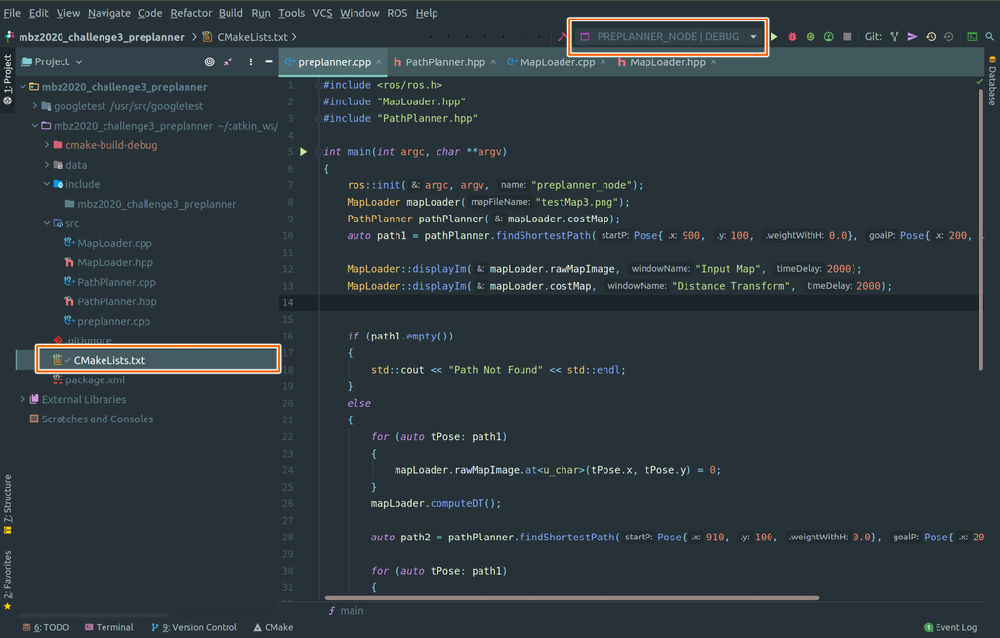

# Evoluția limbajului C++: standarde, compilatoare, medii de dezvoltare

- [Evoluția limbajului C++: standarde, compilatoare, medii de dezvoltare](#evoluția-limbajului-c-standarde-compilatoare-medii-de-dezvoltare)
  - [Istoria limbajului](#istoria-limbajului)
  - [Filosofia limbajului](#filosofia-limbajului)
  - [Starea actuală a limbajului](#starea-actuală-a-limbajului)
  - [Compilatoare](#compilatoare)
    - [GCC](#gcc)
    - [MSVC](#msvc)
    - [Intel C++ Compiler](#intel-c-compiler)
    - [clang](#clang)
    - [llvm](#llvm)
  - [Mediile integrate de dezvoltare](#mediile-integrate-de-dezvoltare)
    - [Code::Blocks](#codeblocks)
    - [Dev-C++](#dev-c)
    - [NetBeans](#netbeans)
    - [Eclipse](#eclipse)
    - [Visual Studio Code](#visual-studio-code)
    - [Visual Studio](#visual-studio)
    - [CLion](#clion)
  - [Bibliografie](#bibliografie)

## Istoria limbajului

Limbajul a fost creat de __Bjarne Stroustrup__ la începutul anilor '80 ca o evoluție a limbajului _C_, dorind să adauge unele caracteristici din limbajul Simula, în special lucrul cu clase și obiecte. Inițial, limbajul s-a numit _"C cu clase"_ (_C with classes_). O descriere preliminară a limbajului a fost publicată sub forma unui raport tehnic la Bell Labs în aprilie 1980 [^1].

La dezvoltarea limbajului, Stroustrup a urmat următoarele criterii:

- Un instrument bun trebuie să ofere mijloace de organizare a programelor similare cu cele din _Simula_: clase, ierarhii de clase, suport pentru paralelism și un control strict (static) al tipurilor, bazat pe clase. Aceste criterii erau considerate esențiale pentru susținerea procesului de proiectare, nu doar pentru implementare;
- Era necesar ca limbajul să genereze programe la fel de rapide ca cele scrise în _BCPL_ (predecesorul lui C) și să permită combinarea modulelor compilate separat într-un singur program, similar cu BCPL. Trebuia să existe o convenție simplă de legare, pentru a putea combina module scrise în diverse limbaje, precum C, Algol68, Fortran, BCPL, asamblor etc. Altfel, programatorul ar fi limitat de restricțiile unui singur limbaj;
- Instrumentul trebuia să asigure portabilitate. Din acest motiv, trebuiau să existe mai multe implementări. Nu trebuia să existe un sistem complex de suport la rulare, dificil de portat, și era permisă doar o dependență minimă de sistemul de operare.

Prima versiune a limbajului a fost disponibilă publicului larg din 1983 și includea:

- clase;
- clase derivate (dar fără funcții virtuale la început);
- controlul accesului – public/privat;
- constructori și destructori;
- funcții apelate la intrare/ieșire din funcție (eliminate ulterior);
- clase prietene;
- controlul și conversia tipurilor argumentelor funcțiilor;
- funcții inline;
- argumente implicite;
- supraîncărcarea operatorului de atribuire.

În 1984 a fost introdus suportul pentru funcții virtuale, ceea ce a marcat începutul programării orientate pe obiect în C++.

Pentru a lucra cu noul limbaj, Stroustrup a dezvoltat _cfront_ – un transpilator (preprocesor) care transforma codul C++ în cod C. Acest preprocesor a influențat dezvoltarea limbajului mulți ani, însă după încercarea de a adăuga suport pentru excepții, proiectul a fost abandonat.

## Filosofia limbajului

La dezvoltarea limbajului C++ s-au urmărit următoarele obiective:

- să creeze un limbaj de programare care să facă programarea mai plăcută pentru programatorii serioși;
- să fie mai bun decât C;
- să susțină abstractizarea datelor;
- să susțină programarea orientată pe obiect.

Aceste obiective au condus la următoarele principii:

- Evoluția C++ trebuie să fie dictată de probleme reale;
- Să nu urmărească perfecțiunea inutilă;
- C++ trebuie să fie util acum;
- Fiecare funcționalitate trebuie să aibă o implementare clară;
- Să existe mereu o cale de tranziție;
- C++ este un limbaj, nu un sistem complet;
- Să ofere suport complet pentru fiecare stil de programare acceptat;
- Să nu oblige utilizatorul la nimic;
- Să susțină metode consacrate de proiectare;
- Să ofere mijloace de organizare a programelor;
- Să exprime clar intențiile programatorului;
- Toate funcționalitățile trebuie să fie adecvate;
- Este mai important să includă o funcționalitate utilă decât să prevină utilizarea greșită;
- Să permită asamblarea programelor din părți dezvoltate independent;
- Fără încălcări implicite ale sistemului static de tipuri;
- Să ofere același suport pentru tipurile definite de utilizator ca și pentru cele încorporate;
- Localitatea este importantă;
- Să evite dependența de ordine;
- În caz de îndoială, să se aleagă opțiunea mai ușor de predat;
- Sintaxa este importantă, chiar dacă uneori nu este logică;
- Utilizarea preprocesorului trebuie evitată;
- Să folosească linker-e tradiționale;
- Fără incompatibilități nejustificate cu C;
- Să nu lase loc pentru un limbaj mai de jos nivel decât C++, cu excepția asamblorului;
- Regula costului zero: nu plătești pentru ce nu folosești;
- În caz de îndoială, să se ofere mijloace de control manual.

## Starea actuală a limbajului

Deja la sfârșitul anilor '80, C++ [^2] a devenit popular, ceea ce a dus la apariția multor compilatoare, fiecare cu propriile particularități. Din această cauză, un program scris pentru un compilator C++ putea să nu funcționeze cu altul (pentru proiecte mari, acest lucru era aproape garantat). Astfel, în 1998 a apărut primul standard C++, care a definit modelul limbajului, sintaxa, biblioteca standard etc.

În 2003 a apărut un nou standard C++, care însă conținea doar corecturi ale standardului anterior.

La dezvoltarea fiecărei secțiuni a viitorului standard C++ se respectă următoarele reguli:

1. menținerea stabilității limbajului și asigurarea compatibilității cu C++98 și, pe cât posibil, cu C;
2. se preferă introducerea noilor funcționalități prin biblioteca standard, nu prin nucleul limbajului;
3. se preferă schimbările care îmbunătățesc tehnicile de programare;
4. îmbunătățirea C++ din perspectiva designului de sisteme și biblioteci, nu prin adăugarea de funcționalități utile doar pentru aplicații specifice;
5. creșterea siguranței tipurilor pentru a oferi alternative sigure la abordările riscante actuale;
6. creșterea performanței și a posibilității de a lucra direct cu hardware-ul;
7. rezolvarea problemelor reale, larg răspândite;
8. simplificarea învățării C++ fără a elimina funcționalități folosite de programatorii avansați.

Se acordă atenție începătorilor, care vor reprezenta mereu majoritatea programatorilor. Mulți nu doresc să aprofundeze C++, limitându-se la utilizarea lui pentru sarcini specifice. De asemenea, datorită versatilității C++ și a utilizării sale extinse (atât ca aplicații, cât și ca stiluri de programare), chiar și profesioniștii pot fi începători când folosesc noi paradigme.

Istoria standardelor și principalele noutăți:

- __C++11__
  - Inițializare universală
  - Constructori și operatori de atribuire cu semantică de mutare
  - Deducerea tipului
  - Buclă pentru colecții (range-based for)
  - Expresii lambda
  - Diverse completări de sintaxă (nullptr, analiza `>>`)
- __C++14__
  - corectarea erorilor din standardul _C++11_
- __C++17__
  - eliminarea trigrafului
  - eliminarea cuvântului cheie __register__
  - eliminarea operatorului `++` pentru tipul `bool`
  - bibliotecă pentru lucrul cu sistemul de fișiere
  - tip variadic `std::any`
  - versiuni paralele pentru unele algoritmi
- __C++20__
  - corectarea erorilor din standardul _C++17_
  - module
  - corutine
  - operatorul de comparație spațială (nava spațială)
  - concepte
  - constante de tip șir ca parametri de șablon
  - inițializare nominală a structurilor
  - bibliotecă de formatare
  - bibliotecă pentru lucrul cu biți
  - bibliotecă de intervale (ranges)
  - bibliotecă de calendare/timp
- __C++23 [^3]__
  - corectarea erorilor din standardul _C++20_

## Compilatoare

### GCC

[GCC (GNU Compiler Collection)](https://gcc.gnu.org) este o suită de compilatoare pentru diverse limbaje de programare, dezvoltată în cadrul proiectului GNU. GCC este software liber, distribuit inclusiv de Free Software Foundation (FSF) sub licențele GNU GPL și GNU LGPL și reprezintă un element cheie al GNU toolchain. Este folosit ca compilator standard pentru sistemele de operare UNIX-like libere.

Inițial numit GNU C Compiler, suporta doar limbajul C. Ulterior, GCC a fost extins pentru a compila cod sursă în limbaje precum C++, Objective-C, Java, Fortran, Ada, Go, GAS și D.

În prezent, GCC este întreținut de o comunitate globală de programatori. GCC este lider în ceea ce privește numărul de procesoare și sisteme de operare suportate.

Fiind compilatorul oficial al sistemului GNU, GCC este și principalul compilator pentru construirea altor sisteme de operare, printre care diverse variante de Linux și BSD (anterior, acum se folosește Clang LLVM), precum și ReactOS, macOS, OpenSolaris, NeXTSTEP, BeOS și Haiku.

GCC este adesea ales pentru dezvoltarea de software care trebuie să funcționeze pe un număr mare de platforme hardware diferite. Diferențele dintre compilatoarele „native” pentru fiecare platformă pot duce la dificultăți în dezvoltarea codului portabil, iar utilizarea mai multor compilatoare complică semnificativ scripturile de build. Folosind GCC pentru compilare multiplatformă, se utilizează același analizator sintactic. Astfel, dacă un program a fost compilat cu succes pentru o platformă țintă, există șanse mari să funcționeze și pe celelalte.

Pentru a folosi GCC pe Windows se utilizează de obicei:

- [MSYS2](https://www.msys2.org) – mediu pentru compilarea și rularea programelor Unix pe Windows;
- [MingW](https://www.mingw-w64.org) – set minim de instrumente pentru compilarea programelor Windows;
- [Cygwin](https://www.cygwin.com) – colecție de programe și biblioteci libere care permit rularea și compilarea programelor Unix pe Windows.

### MSVC

[MSVC (Microsoft Visual C++)](https://learn.microsoft.com/ro-ro/cpp/) este un compilator pentru aplicații C++ dezvoltat de Microsoft și livrat fie ca parte a pachetului Microsoft Visual Studio, fie separat ca [Microsoft Visual Studio Community Edition](https://visualstudio.microsoft.com/downloads/), cu funcționalitate limitată gratuită.

### Intel C++ Compiler

[Intel C++ Compiler](https://www.intel.com/content/www/us/en/developer/tools/oneapi/dpc-compiler.html) este un compilator optimizator dezvoltat de Intel pentru procesoarele x86, x86-64 și IA-64. Principalul avantaj constă în optimizările avansate, inclusiv cele dedicate procesoarelor Intel. Compilatorul funcționează pe Linux, Windows și macOS.

### clang

[Clang](https://clang.llvm.org) este un frontend pentru limbajele C, C++, Objective-C, Objective-C++ și OpenCL C, folosit împreună cu framework-ul LLVM. Clang transpilează codul sursă în bytecode LLVM, după care framework-ul realizează optimizări și generare de cod.

Scopul proiectului este să ofere o alternativă la GNU Compiler Collection (GCC). Dezvoltarea are loc în regim open source în cadrul proiectului LLVM.

La proiect participă angajați ai unor companii precum Google și Apple. Codul sursă este disponibil sub o licență de tip BSD.

### llvm

LLVM (Low Level Virtual Machine) este o infrastructură software pentru crearea de compilatoare și utilitare asociate. Conține compilatoare pentru limbaje de nivel înalt („frontend-uri”), sisteme de optimizare, interpretare și compilare în cod mașină.

Scris în C++, oferă optimizări la compilare, linking și execuție. Inițial, proiectul a inclus compilatoare pentru C și C++ prin frontend-ul Clang, ulterior apărând frontend-uri pentru multe alte limbaje: C#, Fortran, Haskell, Java (bytecode), JavaScript, Ruby, Rust, Scala, Swift și altele.

LLVM poate genera cod mașină pentru numeroase arhitecturi, inclusiv ARM, x86, x86-64, PowerPC, MIPS, SPARC, RISC-V și altele (inclusiv GPU-uri Nvidia și AMD).

Pentru compilarea codului C++, LLVM utilizează propriul backend pentru generarea codului mașină, independent de GCC.

## Mediile integrate de dezvoltare

Un mediu de dezvoltare (IDE – Integrated Development Environment) este un software destinat creării de aplicații. De obicei, un IDE include un editor de text, compilator, depanator și alte instrumente necesare dezvoltării software. În prezent, este greu de imaginat dezvoltarea de proiecte complexe fără un IDE. Se poate scrie un program mic într-un editor simplu și compila din linia de comandă, dar pentru proiecte mari această abordare nu este productivă.

Există numeroase IDE-uri pentru C++, dintre care unele sunt prezentate mai jos.

### Code::Blocks

[Code::Blocks](http://www.codeblocks.org) este un IDE gratuit pentru dezvoltarea de software, inclusiv în C++. Code::Blocks este cross-platform, putând fi folosit pe Windows, Linux și macOS. Este adesea utilizat în școli și universități pentru predarea programării în C++.

### Dev-C++

[Dev-C++](https://github.com/Embarcadero/Dev-Cpp) este un IDE gratuit pentru C++ destinat Windows. Include compilatorul MinGW, care permite compilarea programelor C++ pentru Windows. Deși este considerat depășit, încă este folosit în școli pentru predarea C++.

### NetBeans

[NetBeans](https://netbeans.apache.org) este un IDE gratuit pentru dezvoltarea de software în diverse limbaje, inclusiv C++. Creat inițial de Sun Microsystems, este acum dezvoltat de comunitate cu sprijinul Apache Software Foundation. NetBeans este cross-platform, disponibil pe Windows, Linux și macOS.

### Eclipse

[Eclipse](https://www.eclipse.org) este un IDE gratuit pentru dezvoltarea de software în diverse limbaje, inclusiv C++. Este dezvoltat de comunitate cu sprijinul Eclipse Foundation și este cross-platform (Windows, Linux, macOS).

### Visual Studio Code

[Visual Studio Code](https://code.visualstudio.com) este un IDE gratuit pentru dezvoltarea de software în diverse limbaje, inclusiv C++. Este dezvoltat de Microsoft. Datorită numărului mare de extensii, Visual Studio Code este una dintre cele mai populare soluții pentru dezvoltare. Este cross-platform, disponibil pe Windows, Linux și macOS.

### Visual Studio

[Visual Studio](https://visualstudio.microsoft.com) este un IDE dezvoltat de Microsoft pentru crearea de software în diverse limbaje, inclusiv C++. Visual Studio este un instrument puternic, acoperind toate etapele dezvoltării software: proiectare, dezvoltare, testare și depanare, fiind adesea ales pentru proiecte mari. Compilatorul principal folosit este MSVC. Visual Studio este destinat în principal Windows, dar există și o versiune pentru macOS.

Există și versiunea Visual Studio Community Edition, disponibilă gratuit pentru uz necomercial. Pentru activare este necesară înregistrarea pe site-ul Microsoft cu un cont Microsoft. Această versiune permite dezvoltarea completă, dar este limitată pentru uz comercial.

### CLion

[CLion](https://www.jetbrains.com/clion) este un IDE dezvoltat de JetBrains pentru dezvoltarea de software în C++. CLion este un instrument puternic, acoperind toate etapele dezvoltării: proiectare, dezvoltare, testare și depanare, fiind des ales pentru proiecte mari. CLion folosește compilatoare GCC, MSVC, Clang și altele (dar nu include compilatorul propriu). Principalul instrument de build este CMake. CLion este cross-platform, disponibil pe Windows, Linux și macOS.

Există o licență educațională pentru studenți și profesori, care permite utilizarea gratuită a CLion. Pentru aceasta, este necesară solicitarea unei licențe pe site-ul JetBrains, folosind adresa de e-mail instituțională.

## Bibliografie

[^1]: [Bjarne Stroustrup, Designul și filosofia C++](https://www.google.com/search?q=Страуструп+Бьёрн%2C+Дизайн+и+философия+С%2B%2B)
[^2]: [C++, Wikipedia](https://ro.wikipedia.org/wiki/C%2B%2B)
[^3]: [C++23, Wikipedia](https://en.wikipedia.org/wiki/C%2B%2B23)
