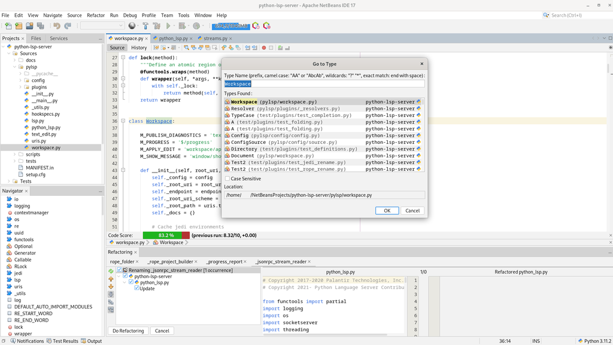

# Dezvoltarea limbajului C++: standarde, compilatoare, medii de elaborare

- [Dezvoltarea limbajului C++: standarde, compilatoare, medii de elaborare](#dezvoltarea-limbajului-c-standarde-compilatoare-medii-de-elaborare)
  - [Istoria limbajului](#istoria-limbajului)
  - [Filosofia limbajului](#filosofia-limbajului)
  - [Starea actuala a limbajului](#starea-actuala-a-limbajului)
  - [Compilatoare](#compilatoare)
    - [GCC](#gcc)
    - [MSVC](#msvc)
    - [Intel C++ Compiler](#intel-c-compiler)
    - [clang](#clang)
    - [llvm](#llvm)
  - [Medii de elaborare](#medii-de-elaborare)
    - [Code::Blocks](#codeblocks)
    - [Dev-C++](#dev-c)
    - [NetBeans](#netbeans)
    - [Eclipse](#eclipse)
    - [Visual Studio Code](#visual-studio-code)
    - [Visual Studio](#visual-studio)
    - [CLion](#clion)
  - [Bibliografie](#bibliografie)

## Istoria limbajului

Limbajul C++ a fost creat de __Bjarne Stroustrup__ la inceputul anilor 80 ca o extensie a limbajului C, in care a vrut sa adauge anumite functionalitati ale limbajului Simula, si anume lucrul cu clase si obiecte. De aceea, la inceput, limbajul a fost numit "C cu clase" (_C with classes_). O descriere preliminara a limbajului a fost publicata sub forma unui raport tehnic la Bell Labs in aprilie 1980 [^1].

In parcursul elaborarii limbajului Stroustrup utiliza urmatoarele criterii:

- un instrument bun trebuie sa ofere mijloace de organizare a programelor, similare celor existente in _Simula_: clase, forma ierarhiei lor, suport pentru paralelism si control puternic (adica static) al tipurilor, bazat pe clase. Aceste criterii i s-au parut esentiale pentru a sprijini procesul de proiectare, nu pentru implementarea programului;
- trebuie sa genereze programe care sa ruleze la fel de repede ca cele scrise in _BCPL_ (predecesorul lui C) si sa aiba capacitatea de a uni module separate compilate intr-un singur program. Trebuie sa existe un acord simplu privind legaturile pentru a putea uni module scrise in diferite limbaje, cum ar fi C, Algol68, Fortran, BCPL, limbaj de asamblare etc. Altfel, programatorul va trebui sa lupte cu restrictiile impuse de un singur limbaj;
- instrumentul trebuie sa ofere o implementare portabila. De aici rezulta ca trebuie sa existe mai multe surse de implementare a instrumentului. Nu trebuie sa existe o infrastructura de suport a timpului de executie atat de complexa, incat sa fie dificil de mutat, si este permisa doar o dependenta foarte limitata a instrumentului de sistemul de operare.

Prima versiune a limbajului a fost accesibila publicului larg incepand cu anul 1983 si implementa:

- clase;
- clase derivate (dar fara functii virtuale);
- controlul accesului (public, privat);
- constructori si destructori;
- functii care sunt apelate la intrarea si iesirea din functie (mai tarziu excluse);
- clase prietene;
- controlul si conversia tipurilor de argumente ale functiei;
- functii inline;
- argumente implicite;
- supraincarcarea operatorului de atribuire.

In anul 1984 a fost implementat suportul functiilor virtuale, ceea ce a marcat inceputul suportului pentru programarea orientata pe obiect.

Pentru nou limbaj creat Stroustrup a dezvoltat translator (preprocesor) _cfront_ care traducea codul sursa in limbajul C. Acest preprocesor multi ani specifica traseu de dezvoltare a limbajului, dar dupa incercarea de a adauga in el suport pentru exceptii, a fost abandonat.

## Filosofia limbajului

Dezvoltarea limbajului C++ este bazata pe urmatoarele principii:

- de creat un limbaj de programare in care dezvoltarea aplicatiilor sa fie mai mai placuta pentru programatorii seriosi;
- mai bun decat C;
- sa suporte abstractiile de date;
- sa suporte programarea orientata pe obiect.

Aceste principii au definit urmatoarele obiective:

- Evolutia limbaului C++ trebuie sa fie definita de probleme reale;
- Nu se urmareste o cursa nesfarsita pentru perfectiune;
- C++ trebuie sa fie util acum;
- Fiecare caracteristica trebuie sa aiba o implementare destul de clara;
- Intotdeauna ramane o cale de trecere;
- C++ este un limbaj, nu un sistem complet;
- Sa se ofere suport pentru fiecare stil de programare;
- Sa nu se faca nimic fortat;
- A se sustine metodele de proiectare stabilite;
- A se oferi mijloace pentru organizarea programelor;
- A se spune exact ceea ce se vrea;
- Toate posibilitatile trebuie sa fie adecvate;
- Mai important este sa includeti o caracteristica utila decat sa preveniti utilizarea gresita;
- A se oferi suport pentru asamblarea programelor din parti dezvoltate independent;
- Sa nu se faca incalcari implicite ale sistemului static de tipuri;
- A se oferi pentru tipurile definite de utilizator aceeasi suport complet ca si pentru cele incorporate;
- definitii locale sunt minunate;
- se evita dependenta de ordine;
- daca sunt indoieli, alegerea unei caracteristici care este mai usor de invatat;
- sintaxa este importanta, chiar daca poate fi ilogica;
- utilizarea preprocesorului trebuie eliminata;
- utilizarea unor linkeri traditionale;
- fara incompatibilitati nejustificate cu C;
- sa nu se lase loc pentru un limbaj de nivel inferior decat C++, cu exceptia limbajului asamblor;
- Regula zero de cost: cu cat nu folositi, cu atat nu platiti;
- daca sunt indoieli, se ofera mijloace pentru control manual.

## Starea actuala a limbajului

La sfarsitul anilor 80, C++ a devenit popular [^2], ceea ce a dus la aparitia unui numar mare de compilatoare, fiecare dintre ele oferind caracteristici proprii. Prin urmare, un program scris in C++ pentru un compilator nu se putea compila cu altul (si pentru proiectele mari acest lucru era garantat). Din acest motiv, in 1998 a fost lansat primul standard al limbajului C++, care a definit modelul limbajului, sintaxa, biblioteca standard etc.

In anul 2003 a fost lansat un nou standard C++, care, cu toate acestea, a continut doar corectii ale vechiului standard.

La elaborarea fiecarui capitol al viitorului standard al limbajului C++, se respecta urmatoarele reguli:

1. sa se asigure stabilitatea limbajului si compatibilitatea cu C++98 si, pe cat posibil, cu C;
2. se prefera introducerea de noi posibilitati prin intermediul bibliotecii standard, nu prin nucleul limbajului;
3. se prefera schimbarile care imbunatatesc tehnica programarii;
4. sa se imbunatateasca C++ din punct de vedere al proiectarii sistemului si al bibliotecii, in loc sa se introduca noi posibilitati utile pentru aplicatii individuale;
5. sa se creasca siguranta tipurilor pentru a oferi o alternativa sigura la abordarile periculoase actuale;
6. sa se creasca performanta si posibilitatea de a lucra direct cu partea hardware;
7. sa se rezolve probleme reale si larg raspandite;
8. sa se implementeze principiul "nu platiti pentru ceea ce nu folositi";
9. sa se faca C++ mai usor de invatat fara a elimina posibilitatile utilizate de programatorii experti.

Multa atentie este acordata programatorilor incepatori, care vor reprezenta intotdeauna o parte semnificativa a programatorilor. Multi incepatori nu incearca sa inteleaga in profunzime C++, limitandu-se la utilizarea acestuia in lucrul cu sarcini specifice. In plus, avand in vedere universalitatea C++ si diversitatea utilizarii sale (inclusiv varietatea aplicatiilor si stilurilor de programare), chiar si profesionistii pot fi incepatori atunci cand utilizeaza noi paradigme de programare.

Un scurt istoric al standardelor cu modificarile importante in ele:

- __с++11__
  - Initializarea universala.
  - Constructori si operatori de atribuire cu semantica de mutare.
  - Deductia tipurilor.
  - Ciclul pentru colectie.
  - Expresii lambda.
  - Diverse adaugiri sintactice (nullptr, analiza `>>`).
- __c++14__
  - corectii si imbunatatiri ale standardului _с++11_.
- __c++17__
  - a fost eliminate trigrarfele.
  - a fost eliminat cuvantul cheie __register__.
  - a fost eliminata operatia `++` pentru tipul `bool`.
  - a fost eliminata lista de exceptii.
  - biblioteca pentru lucru cu sistemul de fisiere.
  - tip variabil `std::any`.
  - versiuni paralele pentru o serie de algoritmi.
- __c++20__
  - corectii si imbunatatiri ale standardului _с++17_.
  - module.
  - corutine.
  - a fost introdus operatorul "spaceship".
  - concepte.
  - constante de siruri ca parametri de sablon.
  - initializare numita a structurilor.
  - biblioteca de formatare.
  - biblioteca de lucru cu biti.
  - biblioteca de intervale.
  - biblioteca de calendare / timp.
- __c++23 [^3]__
  - corectii si imbunatatiri ale standardului _с++20_.

## Compilatoare

### GCC

[GCC (GNU Compiler Collection)](https://gcc.gnu.org) - un set de compilatoare pentru diferite limbaje de programare, dezvoltat in cadrul proiectului GNU. GCC este un software liber, distribuit de Fundatia pentru Software Liber (FSF) sub licentele GNU GPL si GNU LGPL si este un component cheie al GNU toolchain. Este folosit ca compilator standard pentru sistemele de operare bazate pe UNIX.

Compilator GNU C Compiler initial suporta numai limbajul C. Mai tarziu, GCC a fost extins pentru a compila coduri sursa in alte limbaje de programare, cum ar fi C++, Objective-C, Java, Fortran, Ada, Go, GAS si D.

La moment curent sistem GCC se dezvolta de un grup de programatori din intreaga lume. GCC este lider in ceea ce priveste numarul de procesoare si sisteme de operare pe care le suporta.

Fiind un sistem de compilare oficial al GNU, GCC este, de asemenea, compilatorul principal pentru construirea unui numar de alte sisteme de operare; printre acestea se numara diverse distributii Linux si BSD (in trecut, in prezent se foloseste Clang LLVM), precum si ReactOS, macOS, OpenSolaris, NeXTSTEP, BeOS si Haiku.

GCC deseori se selecteaza pentru dezvoltarea produselor software care trebuie sa ruleze pe un numar mare de platforme hardware diferite. Diferentele dintre compilatoarele "natale" pentru fiecare dintre platformele hardware duc la dificultati in dezvoltarea codului, care ar trebui sa fie compilat de catre diferite compilatoare, in plus, utilizarea diferitelor compilatoare complica scripturile de compilare, care ar trebui sa compileze software-ul pentru toate platformele hardware. Utilizarea GCC pentru compilarea codului pentru diferite platforme va folosi acelasi analizator sintactic. Prin urmare, daca a fost posibil sa se compileze un program pentru una dintre platformele hardware, atunci exista o mare probabilitate ca programul sa fie compilat corect si pentru alte platforme.

Pentru lucru cu GCC sub Windows, de obicei se folosesc

- [MSYS2](https://www.msys2.org) - un mediu de construire si pornire a programelor scrise sub Unix in mediu Windows;
- [MinGW](https://www.mingw-w64.org) - un set minim de instrumente pentru construirea programelor sub Windows;
- [Cygwin](https://www.cygwin.com) - un set de programe si biblioteci gratuite care permit rularea si compilarea programelor scrise sub Unix in mediu Windows.

### MSVC

[MSVC (Microsoft Visual C++)](https://learn.microsoft.com/en-en/cpp/) - un compilator pentru aplicatii scrise in C++, dezvoltat de Microsoft si furnizat fie ca parte a setului Microsoft Visual Studio, fie separat sub forma unui set de instrumente functional limitate [Microsoft Visual Studio Community Edition](https://visualstudio.microsoft.com/downloads/).

### Intel C++ Compiler

[Intel C++ Compiler](https://www.intel.com/content/www/us/en/developer/tools/oneapi/dpc-compiler.html) - compilator optimizant dezvoltat de Intel pentru procesoarele x86, x86-64 si IA-64. Principala caracteristica a compilatorului este optimizarea inalt nivelata si orientata catre procesorul Intel. Compilatorul functioneaza sub sistemele de operare Linux, Windows, macOS.

### clang

[Clang](https://clang.llvm.org) este un frontend compilator pentru limbajele de programare C, C++, Objective-C si OpenCL C, care se utilizeaza impreuna cu LLVM. Clang traduce codul sursa in codul LLVM, iar apoi framework-ul efectueaza optimizari si generarea codului.

Scopul proiectului Clang este crearea unui concurent pentru compilatorul GCC. Dezvoltarea Clang se face in cadrul proiectului LLVM. Clang este un software liber, distribuit sub licenta BSD. In cadrul proiectului participa programatori de la Google, Apple, Microsoft si alte companii.

### llvm

LLVM (Low Level Virtual Machine) - proiect de infrastructura software pentru crearea compilatoarelor si a unor utilitati conexe. Proiectul consta dintr-un set de compilatoare pentru limbajele de programare de nivel inalt (__frontend__-uri), un sistem de optimizare, interpretare si compilare a codului in cod masina.

LLVM, scris in C++, ofera optimizari de diferite niveluri, de la simpla eliminare a codului mort pana la optimizari complexe, cum ar fi vectorizarea, inlining-ul si multe altele. Din start in cadrul proiectului au fost realizate compilatoare pentru limbajele C si C++, dar in prezent LLVM suporta o gama larga de limbaje de programare, de exemplu: C#, Fortran, Haskell, Java (bytecode), JavaScript, Ruby, Rust, Scala, Swift si altele.

LLVM poate crea cod masina pentru o gama larga de arhitecturi, inclusiv ARM, x86, x86-64, PowerPC, MIPS, SPARC, RISC-V si altele (inclusiv GPU de la Nvidia si AMD).

Pentru compilarea codului C++ LLVM utilizeaza compilatorul GCC customizat sau CLang.

## Medii de elaborare

Un __mediu de elaborare__ (__IDE__ - Integrated Development Environment), altfel numit __mediu de programare__ sau __mediu de dezvoltare__, este o aplicatie care ofera un set de instrumente pentru dezvoltarea aplicatiilor software. Mediu de elaborare include de obicei un editor de text, un compilator, un depanator si alte instrumente necesare pentru dezvoltarea aplicatiilor software. In prezent, este dificil sa ne imaginam dezvoltarea aplicatiilor software fara utilizarea unui mediu de elaborare. Puteti scrie un mic program intr-un editor de text simplu si sa-l compilati folosind linia de comanda, dar in cazul dezvoltarii unor proiecte mari, acest lucru este neproductiv.

Exista multe medii de elaborare pentru C++, o parte din ele sunt prezentate mai jos.

### Code::Blocks

[Code::Blocks](http://www.codeblocks.org) - un mediu de elaborare gratuit, destinat crearii aplicatiilor software, inclusiv C++. Code::Blocks este un mediu de elaborare multiplatforma, care permite utilizarea sa pe diferite sisteme de operare, inclusiv Windows, Linux si macOS. Code::Blocks este frecvent utilizat pentru a invata programarea in C++ in scoli si universitati.

### Dev-C++

[Dev-C++](https://sourceforge.net/projects/orwelldevcpp) este un mediu de elaborare gratuit pentru C++, destinat sistemului de operare Windows. Dev-C++ include un compilator MinGW, care permite compilarea programelor C++ sub Windows. Dev-C++ este un mediu de elaborare invechit, dar inca este utilizat pentru a invata programarea in C++ in scoli.

### NetBeans

[NetBeans](https://netbeans.apache.org) este un mediu de elaborare gratuit, destinat crearii aplicatiilor software, inclusiv C++. Acest produs a fost creat de compania Sun Microsystems, dar in prezent este dezvoltat de comunitatea de programatori, cu sprijinul Apache Software Foundation. NetBeans este un mediu de elaborare multiplatforma, care permite utilizarea sa pe diferite sisteme de operare, inclusiv Windows, Linux si macOS.

### Eclipse

[Eclipse](https://www.eclipse.org) este un mediu de elaborare gratuit, destinat crearii aplicatiilor software, inclusiv C++. Acest mediu de programare este dezvoltat de comunitatea de programatori, cu sprijinul Eclipse Foundation. Eclipse este un mediu de elaborare multiplatforma, care permite utilizarea sa pe diferite sisteme de operare, inclusiv Windows, Linux si macOS.

### Visual Studio Code

Mediu de elaborare [Visual Studio Code](https://code.visualstudio.com) este un produs gratuit, utilizat pentru a crea aplicatii software in diferite limbaje de programare, inclusiv C++. Se dezvolta de compania Microsoft. Din cauza numarului mare de extensii, care permit utilizarea Visual Studio Code pentru dezvoltarea aplicatiilor software in diferite limbaje de programare (si nu numai), Visual Studio Code este una dintre cele mai populare medii de elaborare. Visual Studio Code este un mediu de elaborare multiplatforma, care permite utilizarea sa pe diferite sisteme de operare, inclusiv Windows, Linux si macOS.

### Visual Studio

Mediu de dezvoltare proprietar [Visual Studio](https://visualstudio.microsoft.com) este un produs dezvoltat de compania Microsoft, utilizat pentru a crea aplicatii software in diferite limbaje de programare, inclusiv C++. Visual Studio este un mediu de elaborare puternic, care ofera un set de instrumente pentru dezvoltarea aplicatiilor software, inclusiv proiectarea, dezvoltarea, testarea si depanarea. Implicit se utilizeaza compilatorul MSVC, dar poate lucra si cu compilatoare Intel sau GCC. Visual Studio este un mediu de elaborare multiplatforma, care permite utilizarea sa pe diferite sisteme de operare, inclusiv Windows, Linux si macOS.

### CLion

Alt mediu de elaborare pentru C++ este [CLion](https://www.jetbrains.com/clion) de la JetBrains. CLion este un mediu de elaborare puternic, care ofera un set de instrumente pentru dezvoltarea aplicatiilor software, inclusiv proiectarea, dezvoltarea, testarea si depanarea. CLion poate utiliza compilatoare GCC, MSVC, CLang si multe alte. CLion este un mediu de elaborare multiplatforma, care permite utilizarea sa pe diferite sisteme de operare, inclusiv Windows, Linux si macOS.

## Bibliografie

[^1]: [Страуструп Бьёрн, Дизайн и философия С++]
[^2]: [C++, Wikipedia](https://ru.wikipedia.org/wiki/C%2B%2B)
[^3]: [C++23, Wikipedia](https://en.wikipedia.org/wiki/C%2B%2B23)
