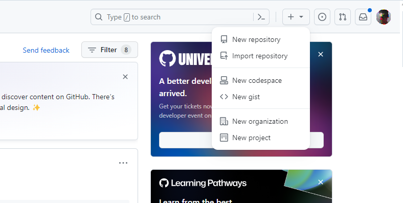

# Crearea unui proiect. Lucru cu GIT

## Scop

După executarea acestei lucrării de laborator student va face cunoștința cu sistem de control codului sursă GIT și va primi cunoștințe de bază necesare pentru organizarea proiectului.

## Sarcina

Pentru simplificarea procesului de lucru se propune să se efectueze pașii în mediul de dezvoltare [`Visual Studio Code`](https://code.visualstudio.com/Download), și cu compilatorul instalat [`MinGW G++`](https://sourceforge.net/projects/mingw-w64/). De asemenea, pe calculator trebuie să fie instalat [`Git`](https://git-scm.com/downloads).

### 1. Crearea contului pe [GitHub](https://github.com/)

### 2. Crearea proiectului

Dupa autentificare pe GitHub, în colțul din dreapta sus există un buton `+`. Apăsând pe el se poate crea un nou repozitoriu.



Creați un nou repozitoriu gol și numiți-l `SnakeGame`.

### 3. Copierea repozitoriului pe calculatorul local

Creati o copie a repozitoriului creat de dvs. Pentru aceasta copiați referinta repozitoriului.


Deschideți linia de comandă, navigați în directorul în care doriți să păstrați proiectul și executați comanda:

```bash
git clone <copied url>
```

Creati o ramură nouă pentru a efectua lucrul.

```bash
# create a new branch and switch to
git checkout -B lab01
```

### 4. Crearea structurii fișierelor

In directorul `SnakeGame` creat de GIT, creați următoarele fișiere:

- `point.hpp`:

```cpp
#pragma once

struct Point{
   int x;
   int y;
};
```

- `apple.hpp`

```cpp
#pragma once

#include "point.hpp"

class Apple {
   Point _position;
public:
   Apple();
   Apple(const Point& position);
   Point GetPosition() const;
};
```

- `direction.hpp`

```cpp
#pragma once

enum class Direction {
   Top, Left, Right, Bottom
};
```

- `snake.hpp`
  
```cpp
#pragma once

#include "apple.hpp"
#include "direction.hpp"
#include "point.hpp"

class Snake {
   Point _segments[100];
   int _nr_segments;
public:
   Snake();
   Snake(const Point& _position);
   void Move(Direction direction);
   int GetSize() const;
   Point GetPosition() const;
   void Eat(const Apple& apple);
};
```

- `board.hpp`

```cpp
#pragma once

class Board {
   int _width;
   int _height;
public:
   Board(int width = 20, int height = 20);
   int GetWidth() const;
   int GetHeight() const;
};
```

- `game_engine.hpp`

```cpp
#pragma once
#include "apple.hpp"
#include "snake.hpp"
#include "board.hpp"

class GameEngine {
   Apple _apple;
   Snake _snake;
   Board _board;
public:
   GameEngine();
   void Init();
   void Run();
};
```

- `painter.hpp`

```cpp
#pragma once

#include "point.hpp"

class Painter {
public:
   void DrawImage(Point topLeft, Point bottomRight, char** image);
   void WriteText(Point position, char* text);
};
```

### 5. Adăugarea descrierii proiectului

Creati în directorul `SnakeGame` fișierul `readme.md` cu următorul conținut:

1. denumirea proiectului
2. ce reprezintă proiectul
3. care sunt regulile jocului Snake
4. enumerați toate tipurile de date noi declarate, oferiți-le o scurtă explicație (ce reprezintă obiectele de acest tip).

### 6. Publicarea codului pe GitHub

In directorul repozitoriului creat executati următoarele comenzi din linia de comandă:

```bash
# add all files to tracking
git add *
# check status
git status
# create a commit
git commit -m "structure defined"
# push commit to remote repository
git push
```

Dupa aceasta puteti adauga ramura creata la ramura `main`, creand un pull request pe GitHub.

## Prezentare

La lucrare de laborator în Moodle adaugați referința repozitoriu.

## Evaluare

- `1p` - crearea contului pe GitHub
- `1p` - crearea proiectului
- `4p` - crearea fișierelor cu structurile necesare
- `3p` - adăugarea descrierii proiectului
- `1p` - publicarea codului pe GitHub in ramura `lab01`
- `-1p` - pentru fiecare zi de întârziere
- `-5p` - pentru copierea codului de la colegi
